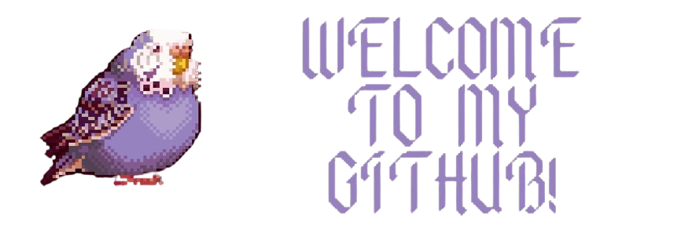

  

<h1 align="center"> Hi,I'm Furkan!</h1>
<h3 align="center"> Passionate Computer Engineering Student | Mobile & Game Developer</h3>

  

---

###  About Me

-  Currently building **Mobile Apps**
-  Learning & exploring: **Unity, Java, Kotlin, Jetpack Compose, React**
-  Backend curious: **Spring Boot, REST APIs, Docker**
-  Always hungry to learn new technologies and deliver real-world projects!

---

###  Featured Projects

<ul>
  <li>
    🎮 <a href="https://play.google.com/store/apps/details?id=com.RaGame.StoneAge" target="_blank"><b>Stone Age: Brick Breaker</b></a> — A prehistoric-themed brick-breaking game available on Google Play!
  </li>
  <li>
    📝 <a href="https://play.google.com/store/apps/details?id=com.furkansoyleyici.easynote" target="_blank"><b>EasyNote</b></a> — A feature-rich note-taking app with colorful customization, reminder notifications, REST API backend & intuitive UI.
  </li>
  <li>
    📝 <a href="https://www.senolsoyleyici.com.tr/" target="_blank"><b>senolsoyleyici.com</b></a> — A beautifully crafted poetry platform with clean UI, dynamic routing, secure JWT authentication, and a modern full-stack architecture.
  </li>
</ul>

---

###  Languages & Tools

  
  
  
  
  
  
  
  
  
  
  

---

###  GitHub Stats

  
  

---

###  Top Languages

  

---

###  Connect with Me

  
  

